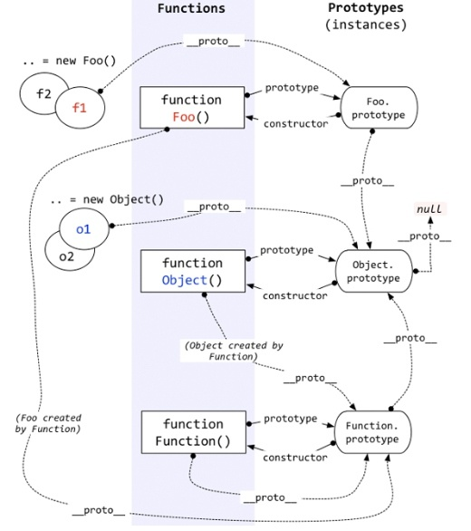

# 原型链



## 类继承

```javascript
function BasicClass() {
  this._basicProp = 'some'
}

BasicClass.prototype = Object.assign(BasicClass.prototype, {
  protoProp() {

  }
})

```

+ 构造函数绑定

  ```javascript
  function ChildClass() {
    BasicClass.apply(this, arguments)

    this._childProp = 'other'
  }
  ```

+ 使用prototype（需要创建实例的开销）

  ```javascript
  function ChildClass() {
    this._childProp = 'other'
  }
  // 子类的原型指向基类的实例
  ChildClass.prototype = new BasicClass()
  // 由于构造函数在原型上，需要重新将构造函数指向自己
  ChildClass.prototype.constructor = ChildClass

  // 由于需要创建基类的实例，如果基类很复杂，开销就很大
  // 改进：使用空函数来充当基类
  function extend(child, base) {
    const F = function() {}
    F.prototype = base.prototype
    child.prototype = new F()
    child.prototype.constructor = child
  }

  ```

+ 直接继承prototype（有很大的副作用）

  ```javascript
  function ChildClass() {
    this._childProp = 'other'
  }
  // 只继承基类的原型属性
  ChildClass.prototype = BasicClass.prototype
  // 修改回原来的构造函数
  ChildClass.prototype.constructor = ChildClass
  // 由于建立了子类与基类原型链关联，即使用同一个引用，
  // 基类的构造函数也被改写
  assert(BasicClass.prototype.constructor === ChildClass, true)
  ```
